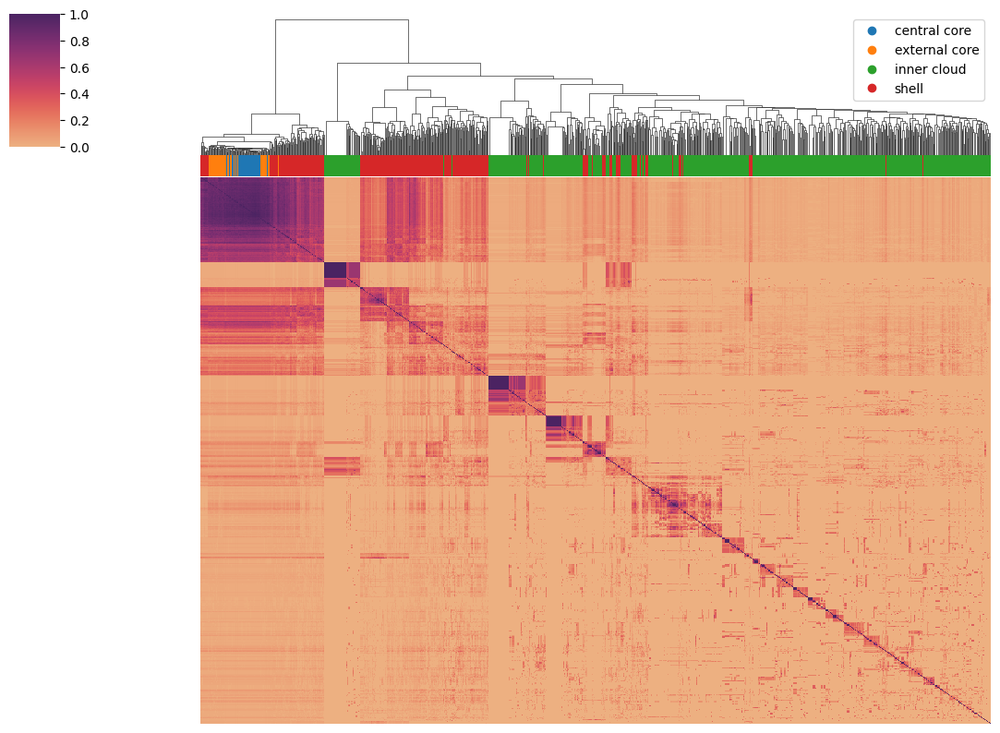
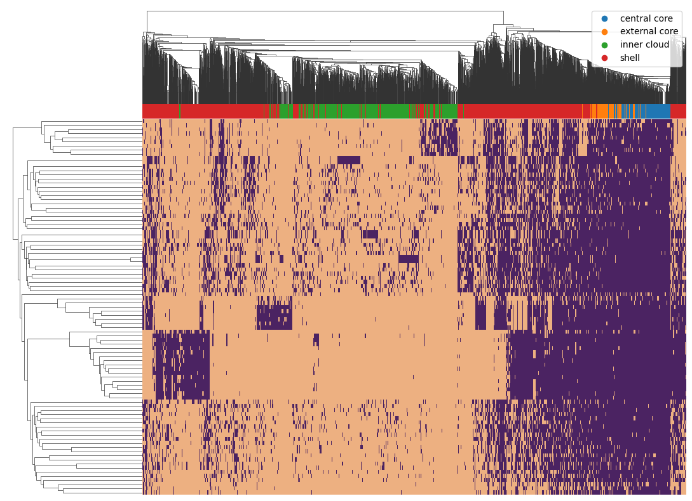

# 2024-pangenome-hash-corr

## Calculating hash correlations across sketches (genomes or metagenomes).

This repository contains four primary command-line scripts:

1. `calc-hash-presence.py` - calculate hash presence/absence information for many samples.
2. `hash-by-hash-assoc.py` - using hash presence info, produce a square similarity matrix of hashval x hashval.
3. `hash-by-sample.py` - using hash presence info, produce a rectangular matrix of hashval x sample.
4. `cluster-hash-assoc.py` - cluster hashes by association and display associated plots.

## Quickstart

Produce the presence/absence dump file by measuring the
presence/absence of the hashes from the given ranktable in the
provided sketches.

```
./calc-hash-presence.py ranktable.agathobacter_faecis.csv \
    gtdb-rs214-agatha-k21.zip -o agatha-genomes.1k.dump \
    --scaled=1000
```

Next, produce a square matrix of hash x hash correlations across samples:
```
./hash-by-hash-assoc.py agatha-genomes.1k.dump \
    -o agatha-genomes.10k.assoc --scaled=10000 --min-presence=2 \
    -C agatha-genomes.10k.assoc.categories.csv
sourmash scripts plot3 agatha-genomes.10k.assoc \
    agatha-genomes.10k.assoc.labels.csv -o agatha-genomes.10k.assoc.png \
    -C agatha-genomes.10k.assoc.categories.csv --no-labels
```

These commands produce this plot:



Finally, produce a rectangular matrix showing hash x genome correlations:
```
./hash-by-sample.py agatha-genomes.1k.dump \
    -o agatha-genomes.10k.presence.csv \
    --categories-csv agatha-genomes.10k.presence.categories.csv
sourmash scripts clustermap1 agatha-genomes.10k.presence.csv -u presence \
    -C agatha-genomes.10k.presence.categories.csv \
    -o agatha-genomes.10k.presence.png --boolean --no-labels
```

These commands produce this plot:



## Documentation

### `calc-hash-presence.py`

Usage: 
```
./calc-hash-presence.py <ranktable_csv> <sample1> [<samples ...>] \
    -o <output>.dump
```
will calculate presence/absence info for the hash values in
`ranktable_csv` across `sample*` sketches, saving the info to
`<output>.dmp`.

`ranktable_csv` is in the format produced by the
`sourmash_plugin_pangenomics` command `pangenome_ranktable`.

Optional parameters:

* `-k`, `--ksize` - select k-mer size
* `filter-samples` - use only these samples (CTB: more docs needed)
* `--moltype` (@CTB: does not yet work)

### `hash-by-hash-assoc.py`

Usage: 
```
./hash-by-hash-assoc.py <presence_dump> -o <output_csv>
```
will calculate a square similarity matrix of hashes by hashes, where
each value is the Jaccard similarity of the hash presence vectors
across sketches. This matrix is in numpy binary format nad can be
displayed by several of the `plot` functions from the betterplot
plugin.

**Warning:* The output files are a little more complicated than the
command line suggests! `hash-by-hash-assoc.py` produces _two_ files
with `-o` - first, the specified filename, which is a numpy binary
matrix; and second, a 'labels_to' CSV file (see
[sourmash compare docs](https://sourmash.readthedocs.io/en/latest/command-line.html#sourmash-compare-compare-many-signatures)) that provides label names.
This second file is named `<output>.labels.csv`, and must be passed in
explicitly to `sourmash plot --labels-from` as well as `plot2` and `plot3`.

Optional parameters:

* `--scaled` - downsample from scaled chosen for `calc-hash-presence.py`
* `--min-presence` - require that hashes be present in at least this many samples
* `--pangenome-types` - require that hashes be of this pangenome rank (default: '12345')
* `--categories-csv` - write a categories file suitable for betterplot category coloring
* `--compare-csv` - write an output square matrix CSV.

### `hash-by-sample.py`

Usage: 
```
./hash-by-sample.py <presence_dump> -o <output_csv> 
```
will calculate a rectangular matrix matching hashes to samples,
suitable for display by e.g.  `clustermap1` from the betterplot
plugin.

Optional parameters:

* `--scaled` - downsample from scaled chosen for `calc-hash-presence.py`
* `--min-presence` - require that hashes be present in at least this many samples
* `--pangenome-types` - require that hashes be of this pangenome rank (default: '12345')
* `--categories-csv` - write a categories file suitable for betterplot category coloring of hash pangenome rank types (e.g. for use in column category coloring with `clustermap1`).

### `cluster-hash-assoc.py`

Usage: 
```
./cluster-hash-assoc.py.py <presence_dump> -o <output_csv> 
```
will calculate clusters of hashes and output them as sourmash sketches.
One output option is a "categories" file that matches hash values to clusters
and can be used in customizing downstream plots and analyses.
It will also optionally output a labeled tSNE plot,
a hash-by-hash association plot, and a sample-by-hash presence/absence plot,
all annotated with the clusters.

Optional parameters:

* `--scaled` - downsample from scaled chosen for `calc-hash-presence.py`
* `--min-presence` - require that hashes be present in at least this many samples
* `--output-tsne-plot` - save tSNE plot to this file
* `--output-assoc-plot` - save hash-by-hash association plot to this file
* `--output-presence-plot` - save sample-by-hash presence/absence plot to this file
* `--cluster-prefix` - filename prefix to prepend to output clusters.
* `--save-categories-csv` - filename to save hashvals and labels to.
